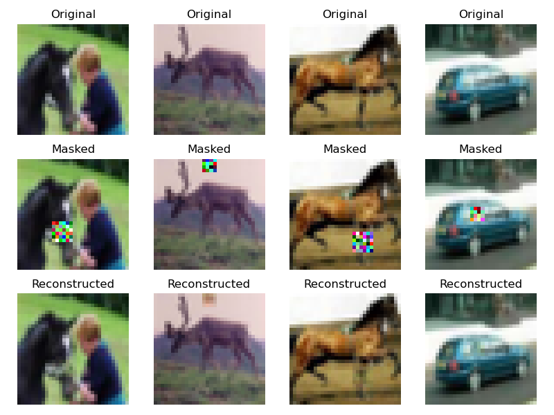
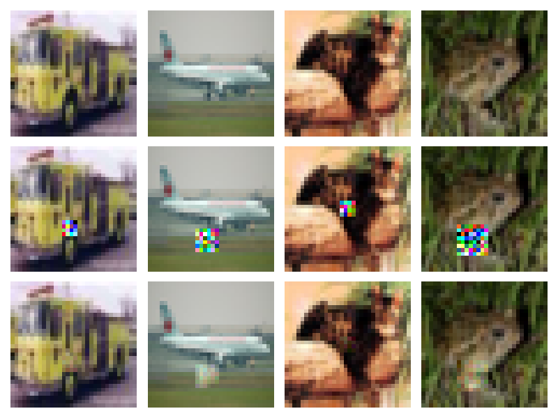
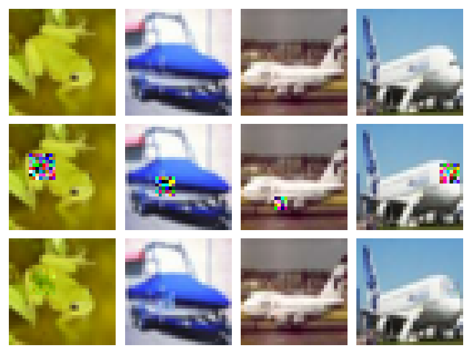

# Diffusion-Based Image Inpainting

This repository implements a simplified conditional diffusion model for image inpainting on CIFAR-10.

The model learns to reconstruct missing regions by iteratively denoising Gaussian noise, conditioned on visible pixels.

---


## Method

- Forward process: Gaussian noise injection
- Reverse process: neural network predicts noise
- Conditioning: masked image + binary mask
- Inpainting: known pixels enforced during sampling

---

## Results

Example reconstruction:





---

## Usage

```bash
pip install -r requirements.txt
python examples/run_inpainting.py
